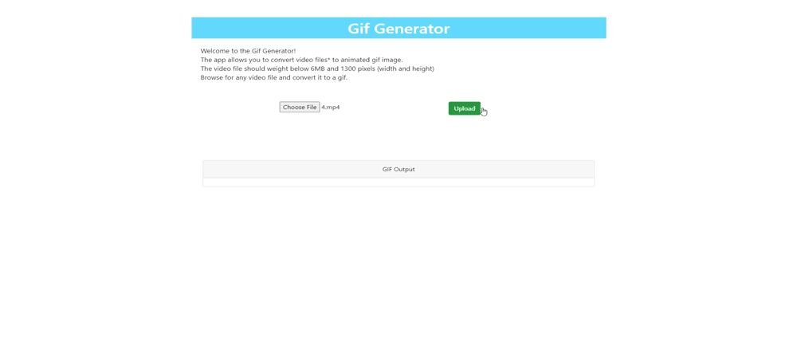

# Gif Generator App

## Motivation 

The app utilizes an API of  [GIF generator](https://github.com/doryunger/gogif) and allows the user to interact with it.

## Overview
The backend of the app is based on Python (Django) which is wrapped by Gunicorn and Gevent.
React has beed used for the Frontend. 

## Useage
The app receiving a video file as an input and returns a gif image.
The app supports most of the video files.
Files should weight below 6 MB (for a reasonable time of conversion) and also be smaller than 1300 pixels (for the same reason). 

